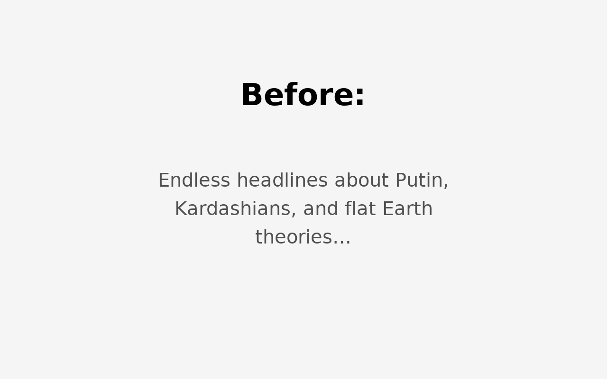
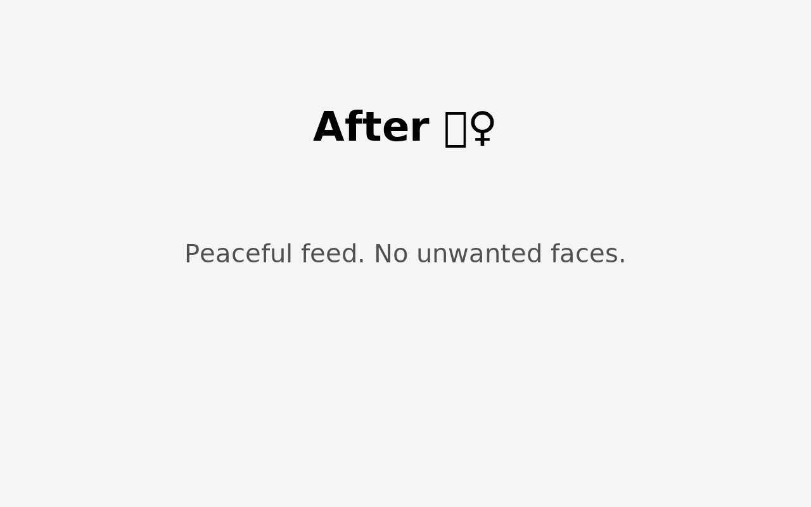
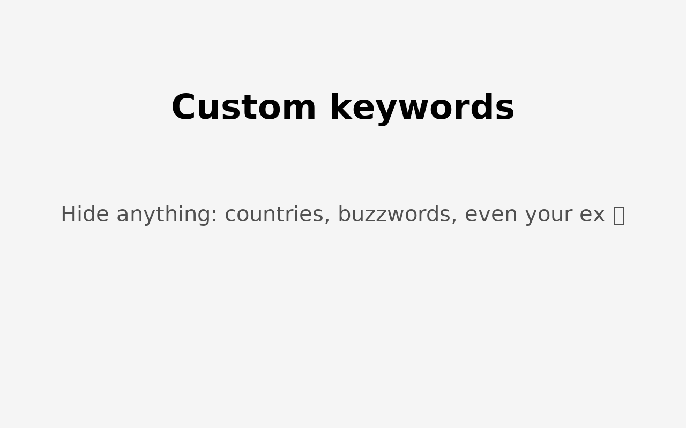

# 📰 News Cleaner  

Install from [Google Web Store](https://chrome.google.com/webstore/detail/gnpjiekbgmnapiliihemhhnfjnkagppc)

Tired of seeing the same faces everywhere?  
Putin, Kardashians, or yet another flat Earth theory?  
Say no more — **News Cleaner** has your back! 🚀  

This Chrome extension wipes away all the "blah-blah" you don’t want to see.  

---

## ✨ Features  

- 🔍 **Keyword blocking** — add any names, places, or nonsense topics you never want to read again.  
- 🤖 **Smart detection** — catches different word forms (so “Putin’s” or “Putina” also get the boot).  
- 📊 **Counter** — see how many headlines were blocked on each site.  
- ⏸️ **Pause anytime** — disable on the current site with one click.  
- ⚙️ **Easy settings** — all in a neat popup, just like AdBlock.  

---

## 📸 Screenshots  

### Before
Annoying news everywhere 🙄  

### After
Clean feed, happy mind ✨  

### Custom keywords
Block whatever you want — from Putin to Kardashians to flat Earth theories 🌍🙃  

### Context menu
Right-click → Block this topic instantly  

---

## 🚀 Installation  

1. Clone or download this repo.  
2. Go to `chrome://extensions/`.  
3. Enable **Developer Mode**.  
4. Click **Load unpacked** and select the folder.  
5. Done! Refresh your news site and enjoy the silence.  

---

## 😂 Example Use Cases  

- Block every mention of *flat Earth* conspiracies 🌍➡️🛑  
- Pretend the Kardashians never existed 💅  
- Make your news feed Putin-free 🕊️  

---

## 🛡️ Privacy  

We don’t collect or send *any* of your data. Everything happens locally in your browser.  
No ads, no trackers, no spying. Pinky promise 🤞  

---

## 🤝 Contribute  

Got an idea? A bug? Or just want to block your least favorite celebrity?  
Open an issue or send a PR — contributions are welcome!  

---

## ⚖️ License  

MIT License. Do whatever you want with it, but don’t blame us if your news feed suddenly feels *too peaceful*.  
